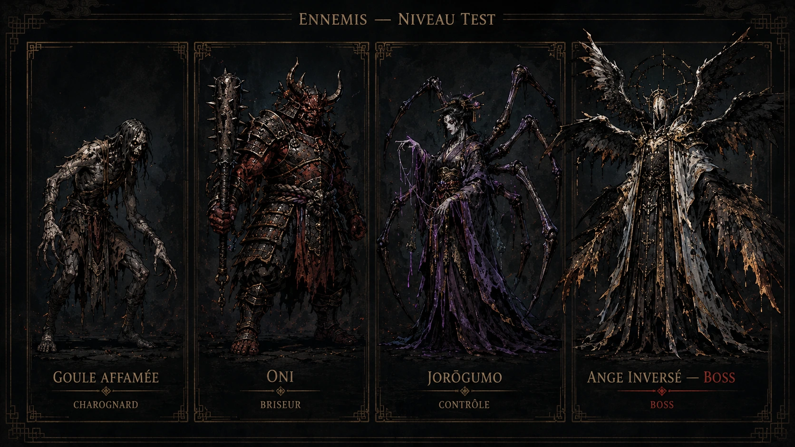

# Palette des ennemis — niveau test

Cette planche fixe la direction visuelle des quatre silhouettes principales du premier niveau test. Elle sert de référence de production pour la modélisation, les matériaux, les animations et les futures cartes d'ennemis.

| Ennemi | Rôle de combat | Intention visuelle |
|---|---|---|
| Goule affamée | Charognard | Silhouette maigre, basse et nerveuse ; tissus brûlés et peau cendreuse. |
| Oni | Briseur | Masse frontale lourde ; armure japonaise dégradée et arme contondante. |
| Jorōgumo | Contrôle | Silhouette verticale et arachnéenne ; étoffes violettes et membres articulés. |
| Ange inversé | Boss | Figure sacrée corrompue ; ailes noires, halo brisé et contraste ivoire/or. |

## Direction commune

- dark fantasy lisible en vue de jeu ;
- palette charbon, cendre, bronze terni et accents violets ;
- silhouettes nettement distinctes pour identifier immédiatement leur rôle ;
- détails d'inspiration asiatique cohérents avec la Terre des Cendres ;
- cette planche est une référence artistique et ne remplace pas encore les modèles ou sprites utilisés à l'exécution.
